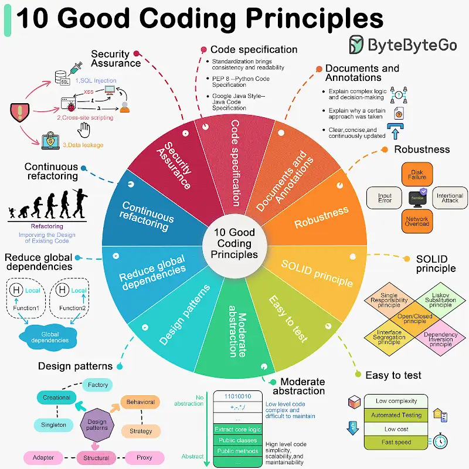

10 Good Coding Principles to improve code quality. The download link can be found at the end.

Software development requires good system designs and coding standards. We list 10 good coding principles in the diagram below.

🔹 01 Follow Code Specifications
When we write code, it is important to follow the industry's well-established norms, like “PEP 8”, “Google Java Style”, adhering to a set of agreed-upon code specifications ensures that the quality of the code is consistent and readable.

🔹 02 Documentation and Comments
Good code should be clearly documented and commented to explain complex logic and decisions, and comments should explain why a certain approach was taken (“Why”) rather than what exactly is being done (“What”). Documentation and comments should be clear, concise, and continuously updated.

🔹 03 Robustness
Good code should be able to handle a variety of unexpected situations and inputs without crashing or producing unpredictable results. Most common approach is to catch and handle exceptions.

🔹 04 Follow the SOLID principle
“Single Responsibility”, “Open/Closed”, “Liskov Substitution”, “Interface Segregation”, and “Dependency Inversion” - these five principles (SOLID for short) are the cornerstones of writing code that scales and is easy to maintain. 

🔹 05 Make Testing Easy
Testability of software is particularly important. Good code should be easy to test, both by trying to reduce the complexity of each component, and by supporting automated testing to ensure that it behaves as expected.

🔹 06 Abstraction
Abstraction requires us to extract the core logic and hide the complexity, thus making the code more flexible and generic. Good code should have a moderate level of abstraction, neither over-designed nor neglecting long-term expandability and maintainability.

🔹 07 Utilize Design Patterns, but don't over-design 
Design patterns can help us solve some common problems. However, every pattern has its applicable scenarios. Overusing or misusing design patterns may make your code more complex and difficult to understand.

🔹 08 Reduce Global Dependencies
We can get bogged down in dependencies and confusing state management if we use global variables and instances. Good code should rely on localized state and parameter passing. Functions should be side-effect free.

🔹 09 Continuous Refactoring
Good code is maintainable and extensible. Continuous refactoring reduces technical debt by identifying and fixing problems as early as possible.

🔹 10 Security is a Top Priority
Good code should avoid common security vulnerabilities. Especially code for financial applications must be free from SQL injection, cross-site scripting (XSS) and data leakage.

