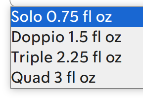

咖啡烘焙程度

| 焙度  | 英文對照 | 失重比（%） | 常見Agtron值 | 出豆時機 |
| :---: | :---: | :---: | :---: | :---: |
| 極淺焙 | Light roast | 8-13 | 70-84 |  一爆密集到一爆末 |
| 淺焙（肉桂烘焙） | Cinnamon roast | 11-14 | 65-69 |  一爆結束 |
| 淺中焙 | Medium roast | 13-15 | 60-64 |  一爆結束後30-40秒 |
| 中度微深烘焙 | High roast | 14-16 | 55-59 |  接近二爆前 |
| 中深焙 | City roast | 16-18 | 44-54 |  二爆開始20-40秒 |
| 深焙  | Full city roast | 17-19 | 36-43 |  二爆密集 |
| 法式烘焙 | French roast | 19-21 | 26-35 |  二爆尾聲 |
| 義式烘焙 | Italian roast | 21-23 | 18-25 |  二爆結束 |

#### Size of espresso

1 fl oz = 29.6 cc

## Roast

| 程度    | 特色    |
| --- | --- |
|      Cinnamon           Light | **浅度烘焙**      * 适合冷萃咖啡      * 颜色浅棕      * 表面没有油脂      * 品尝咖啡豆产地的独特风味      * **酸度**：★ ★ ★ ★      * **苦味**：★ ☆ ☆ ☆      * **油腻**：★ ☆ ☆ ☆ |
|      City           Medium | **中度烘焙**      * 适合冷萃、手冲、滴滤      * 颜色中棕      * 比浅烘焙略甜      * 口味、香气和酸度平衡      * **酸度**：★ ★ ★ ☆      * **苦味**：★ ★ ☆ ☆      * **油腻**：★ ★ ☆ ☆ |
|      Full City           Dark | **中深烘焙**      * 适合意式浓缩、法压      * 颜色浓郁，表面少许油脂      * 苦中带甜的余韵      * 口味香气浮现，酸度逐渐消失      * **酸度**：★ ★ ☆ ☆      * **苦味**：★ ★ ★ ☆      * **油腻**：★ ★ ★ ☆ |
|      French           Italian | **深度烘焙**      * 最适合意式浓缩      * 漆黑发亮，表面油腻      * 明显的苦味      * 原始风味消失、烘焙味道突出      * **酸度**：★ ☆ ☆ ☆      * **苦味**：★ ★ ★ ★      * **油腻**：★ ★ ★ ★ |

